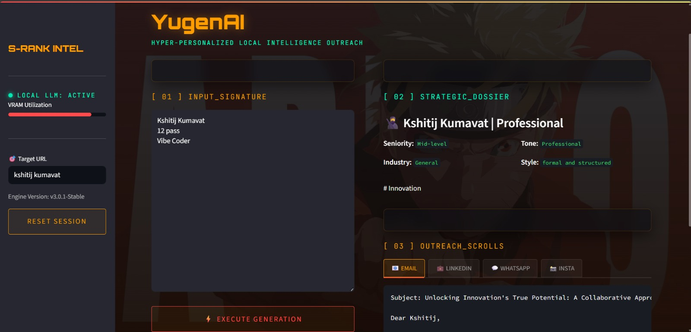

🚀 YŪGENAI

Offline LLM-Powered Hyper-Personalized Cold Outreach Engine

Problem Statement ID: SBM02 – Social Booster Media Domain
Xenia Hackathon 2026

## Streamlit UI Preview


## Generated Outreach Response


📌 Overview

Cold outreach remains one of the most widely used strategies for connecting with customers, partners, and talent. However, most outreach today is generic, poorly personalized, tone-mismatched, and heavily dependent on cloud-based AI services — raising concerns around privacy, cost, and scalability.

YūgenAI is a privacy-first, fully offline LLM-powered outreach engine that generates hyper-personalized, tone-adaptive, multi-channel cold messages using structured persona intelligence — without relying on external AI APIs.

🎯 Problem Statement

Design and build an offline cold outreach automation system that:

1. Runs entirely on a locally hosted LLM

2. Generates multi-channel personalized outreach

3. Adapts tone based on recipient communication style

4. Stores and reuses previous outreach intelligence

5. Operates without any external AI API dependency

💡 Our Solution

YūgenAI transforms cold outreach from template-based messaging into intelligent, context-aware communication. The system:

Accepts LinkedIn profile text or mock profile data

Extracts structured persona attributes (role, industry, tone, interests, seniority)

Infers communication style automatically

Uses a fully offline LLM (via Ollama)

It Generates:

📧 Cold Email

💬 WhatsApp Message

🔗 LinkedIn DM

📸 Instagram DM

Stores persona and outreach data locally for adaptive memory reuse

Secure. Offline. Intelligent. Multi-Channel Outreach — Powered by Persona-Aware AI.

⚙️ Installation & Setup
1️⃣ Install Ollama

Download and install:
```bash
👉 https://ollama.com
```

Verify:
```bash
ollama --version
```

3️⃣ Clone Repository
```bash
git clone https://github.com/yourusername/yugenai.git
cd yugenai
```

4️⃣ Install Dependencies
```bash
pip install -r requirements.txt
```

OR manually install Streamlit:
```bash
pip install streamlit
```

5️⃣ Run the Streamlit App
```bash
streamlit run app.py
```

Your browser will automatically open at:
```bash
http://localhost:8501
```